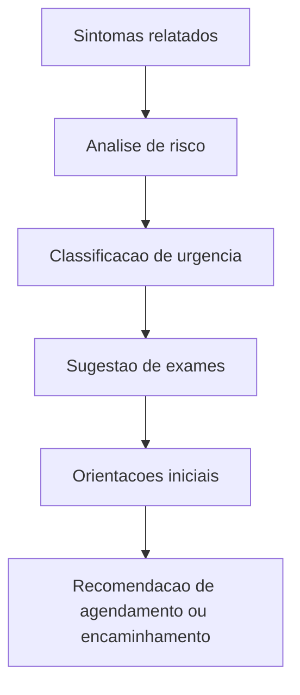
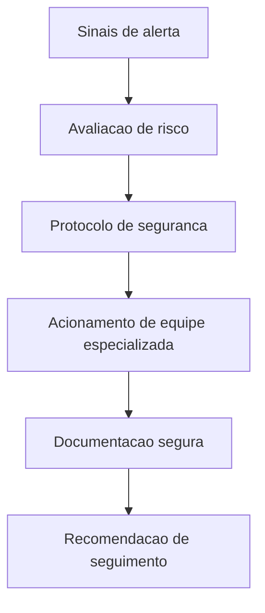
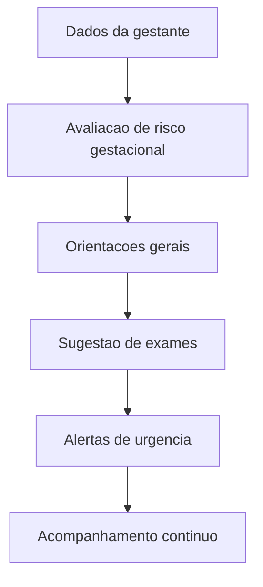
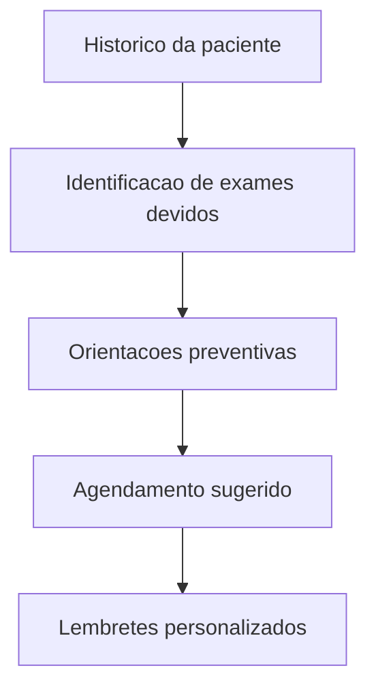

# Assistente Virtual Médico - Saúde e Segurança da Mulher

Projeto acadêmico para o Tech Challenge Fase 3. O sistema simula um assistente virtual de apoio clínico especializado em saúde feminina, com foco em segurança da paciente, privacidade, LGPD, explainability e fluxos automatizados com LangGraph. Ele nunca substitui profissionais de saúde, não prescreve medicamentos e não fornece diagnóstico definitivo.

## Objetivo

Desenvolver uma aplicação com LLM e automação de fluxos para:

- responder perguntas contextualizadas sobre saúde da mulher;
- consultar base de conhecimento local sintética;
- executar triagens e protocolos simulados com LangGraph;
- registrar auditoria e proteger dados sensíveis;
- bloquear respostas perigosas;
- demonstrar pipeline de fine-tuning ou simulação técnica equivalente.

## Arquitetura

O projeto segue separação por responsabilidades:

- `app/config/`: configuração da aplicação.
- `app/domain/`: modelos de domínio.
- `app/services/`: serviços principais do assistente e protocolos.
- `app/chains/`: organização da chain principal.
- `app/graphs/`: acesso aos fluxos LangGraph.
- `app/security/`: acesso aos módulos de segurança.
- `app/validators/`: validação e bloqueio de respostas inseguras.
- `app/datasets/`: ponto interno para datasets sintéticos.
- `app/logs/`: estrutura local de logs.
- `app/tests/`: ponto reservado para testes no escopo do app.
- `app/training/`: pipeline acadêmico de fine-tuning simulado.
- `datasets/`: base sintética acadêmica e casos demonstrativos.
- `tests/`: cobertura automatizada de segurança, fluxos e auditoria.
- `docs/`: relatório técnico.

## Tecnologias Utilizadas

- Python 3.11+
- FastAPI
- Pydantic
- LangChain
- LangChain Community
- LangGraph
- FAISS
- pytest

## Como Rodar

1. Criar e ativar ambiente virtual:

```bash
python -m venv .venv
source .venv/bin/activate
```

2. Instalar dependências:

```bash
pip install -e .
```

Arquivo de ambiente de exemplo:

```bash
cp .env.example .env
```

3. Preparar dataset para fine-tuning simulado:

```bash
python app/training/prepare_dataset.py
python app/training/simulate_finetuning.py
python app/training/evaluate.py
```

Arquivos gerados pelo pipeline:

- `data/train.json`, `data/validation.json`, `data/test.json`
- `data/train.jsonl`, `data/validation.jsonl`, `data/test.jsonl`
- `data/fine_tuning_manifest.json`

4. Executar a API:

```bash
uvicorn app.main:app --reload
```

Ou com Docker:

```bash
docker compose up --build
```

5. Executar a interface visual com Streamlit:

```bash
streamlit run streamlit_app.py
```

6. Rodar demonstrações:

```bash
python examples/run_demos.py
```

7. Rodar testes:

```bash
pytest
```

## Como Funciona o Assistente

O assistente usa uma cadeia com LangChain para:

1. receber a pergunta e contexto;
2. anonimizar dados sensíveis;
3. recuperar trechos relevantes da base sintética local;
4. construir resposta explicável com fonte e nível de confiança;
5. validar a resposta antes do retorno.

A recuperação é híbrida:

- score lexical local para preservar previsibilidade acadêmica;
- indexação vetorial com FAISS e embeddings determinísticas para demonstrar arquitetura RAG local sem depender de download de modelos.

Cada resposta retorna:

- resumo da orientação;
- justificativa;
- fonte/protocolo;
- nível de confiança;
- limites da resposta;
- dados adicionais necessários;
- recomendação de encaminhamento;
- nível de risco.

## Fluxos LangGraph

### 1. Triagem ginecológica

Sintomas relatados -> análise de risco -> classificação de urgência -> sugestão de exames -> orientações iniciais -> encaminhamento.



### 2. Violência doméstica

Sinais de alerta -> avaliação de risco -> protocolo de segurança -> acionamento de equipe especializada -> documentação segura -> seguimento.



### 3. Fluxo obstétrico

Dados da gestante -> avaliação de risco gestacional -> orientações -> exames recomendados -> alertas de urgência -> acompanhamento.



### 4. Prevenção

Histórico da paciente -> identificação de exames em atraso -> orientações preventivas -> sugestão de agendamento -> lembretes organizacionais.



## Endpoints Disponíveis

- `GET /health`: status da aplicação.
- `POST /assist`: resposta assistida com explainability.
- `POST /assistente/pergunta`: alias no formato solicitado pelo enunciado.
- `GET /protocols`: lista protocolos sintéticos; aceita filtro `category`.
- `GET /protocols/{doc_id}`: detalhe de um protocolo local.
- `GET /auditoria/relatorio-especialidade`: relatório agregado de acesso por especialidade.
- `POST /flows/triage`
- `POST /flows/obstetric`
- `POST /flows/prevention`
- `POST /flows/violence`
- `POST /fluxo/triagem-ginecologica`
- `POST /fluxo/violencia-domestica`
- `POST /fluxo/obstetrico`
- `POST /fluxo/prevencao`

## Interface Visual

O projeto inclui uma interface em Streamlit com:

- pergunta clínica contextualizada;
- abas para os quatro fluxos LangGraph;
- visualização de risco, confiança, fonte e limites;
- navegação pelos protocolos sintéticos;
- painel de auditoria agregada por especialidade.

Arquivo principal:

- `streamlit_app.py`

## Fine-Tuning ou Simulação

O projeto inclui uma simulação técnica de fine-tuning em `app/training/`:

- `prepare_dataset.py`: normaliza terminologia, anonimiza dados, valida exemplos, resume balanceamento e exporta treino, validação e teste em JSON e JSONL.
- `simulate_finetuning.py`: gera histórico de epochs e métricas sintéticas de grounding, segurança e consistência.
- `evaluate.py`: resume métricas finais.

Em ambiente real, esse pipeline seria substituído por treinamento supervisionado de um modelo open-source pequeno com dados sintéticos, validação clínica, avaliação de segurança e revisão humana.

O dataset sintético inclui:

- FAQs em saúde da mulher;
- protocolos ginecológicos e obstétricos;
- sinais de alerta em violência doméstica;
- laudos sintéticos de mamografia e ultrassom;
- procedimento ginecológico sintético;
- protocolo de pré-natal;
- base sintética de segurança medicamentosa sem prescrição.

## Exemplos de Uso

Pergunta clínica contextualizada:

```json
{
  "question": "Estou no pós-parto e com tristeza persistente. Isso é sinal de alerta?",
  "patient_context": {
    "postpartum_days": 21
  }
}
```

Caso de recusa por segurança:

```json
{
  "question": "Qual remédio e dose exata devo tomar agora?",
  "patient_context": {}
}
```

## Cuidados com LGPD e Segurança

- uso exclusivo de dados sintéticos e anonimizados;
- mascaramento de telefone, email e CPF;
- remoção de campos identificadores em payloads;
- verificação de identidade simulada para o solicitante;
- criptografia simulada para trilhas de auditoria e acesso;
- auditoria com log mínimo necessário;
- monitoramento de acessos por especialidade;
- confidencialidade reforçada em casos sensíveis;
- encaminhamento obrigatório em risco alto, urgência obstétrica ou suspeita de violência doméstica.

## Integração Hospitalar Simulada

- não existe integração real com prontuário, hospital, farmácia ou agenda;
- a arquitetura demonstra onde protocolos, histórico, fluxos e auditoria seriam conectados;
- toda integração descrita é meramente ilustrativa e acadêmica.

## Casos de Uso

- apoio à triagem ginecológica;
- apoio ao seguimento obstétrico;
- orientação preventiva e rastreamento;
- detecção de sinais de violência doméstica com encaminhamento seguro;
- apoio documental e consulta a protocolos sintéticos por especialidade.

## Avaliação, Bias e Equidade

- métricas sintéticas de grounding e segurança são geradas em `data/finetuning_metrics.json`;
- o manifesto `data/fine_tuning_manifest.json` resume balanceamento por categoria, especialidade e representatividade;
- a avaliação de equidade é acadêmica e deve evoluir com revisão multidisciplinar e ampliação da base sintética.

## Feedback Profissional

- a validação por especialistas está simulada e descrita em [docs/validacao_especialistas.md](/mnt/c/desenvolvimento/repositorio/tech-challenge-fase3/docs/validacao_especialistas.md:1);
- o uso real exigiria revisão formal de ginecologia, obstetrícia, saúde mental, assistência social e governança clínica.

## Limitações Éticas

- o sistema não substitui consulta médica, psicológica, social ou jurídica;
- a base é sintética e acadêmica, sem valor assistencial real;
- não há prescrição, diagnóstico definitivo nem personalização terapêutica;
- recomendações preventivas dependem de diretrizes institucionais e avaliação individual.

## Demonstração em Vídeo

Para um vídeo de até 15 minutos:

1. apresentar objetivo, escopo acadêmico e guardrails.
2. mostrar a arquitetura e pastas principais.
3. executar `python examples/run_demos.py`.
4. demonstrar chamada à API `POST /assist`.
5. executar um fluxo de triagem e um de violência doméstica.
6. mostrar o pipeline de fine-tuning simulado.
7. encerrar com limitações éticas, LGPD e próximos passos.
