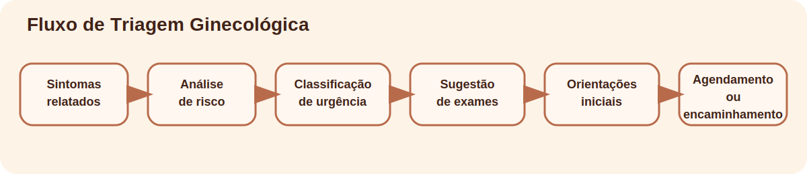
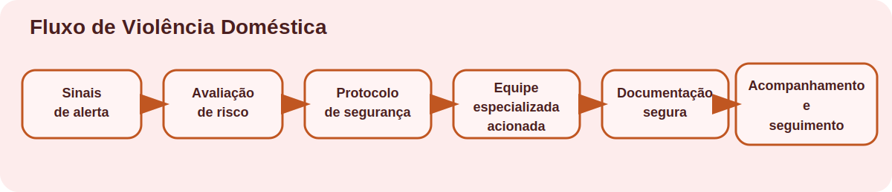
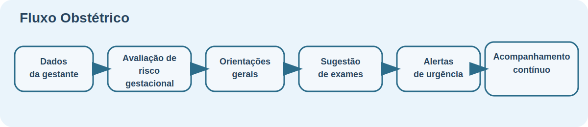
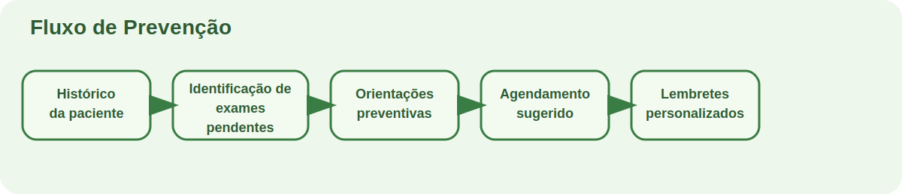

# Relatório Técnico

## Assistente Virtual Médico Especializado em Saúde e Segurança da Mulher

### Tech Challenge – Fase 3

### Resumo

Este relatório técnico apresenta o desenvolvimento de um assistente virtual médico especializado em saúde e segurança da mulher, concebido como ferramenta acadêmica de apoio à decisão clínica. A solução integra modelos de linguagem, recuperação contextual de conhecimento, fluxos automatizados com LangGraph e mecanismos explícitos de segurança, explicabilidade e proteção de dados. O sistema foi estruturado para responder a consultas contextualizadas, apoiar triagem ginecológica e obstétrica, identificar sinais compatíveis com violência doméstica, sugerir organização de exames preventivos e reforçar a necessidade de encaminhamento profissional em situações críticas. O projeto utiliza exclusivamente dados sintéticos e processos simulados de fine-tuning, preservando aderência ética, conformidade com princípios da LGPD e limitação metodológica compatível com ambiente acadêmico. São detalhados o processo de curadoria de dados, técnicas de anonimização, métricas de avaliação, fluxos clínicos, guardrails de segurança, análise de bias e cenários de uso. Conclui-se que a arquitetura proposta demonstra viabilidade técnica para apoio especializado em saúde da mulher, desde que mantido o princípio de supervisão clínica obrigatória e o reconhecimento explícito de que a ferramenta não substitui profissionais habilitados.

**Palavras-chave:** inteligência artificial em saúde; LLM; LangChain; LangGraph; saúde da mulher; segurança da paciente; LGPD; apoio à decisão clínica.

### Abstract

This technical report presents the development of a virtual medical assistant specialized in women’s health and safety, designed as an academic clinical decision-support tool. The solution integrates language models, contextual knowledge retrieval, automated workflows with LangGraph, and explicit mechanisms for safety, explainability, and data protection. The system was structured to answer contextualized questions, support gynecological and obstetric triage, identify signs compatible with domestic violence, suggest preventive screening organization, and reinforce the need for professional referral in critical situations. The project uses exclusively synthetic data and a simulated fine-tuning process, preserving ethical alignment, compliance with data protection principles, and methodological limitations consistent with an academic environment. The report details data curation, anonymization techniques, evaluation metrics, clinical workflows, safety guardrails, bias analysis, and usage scenarios. It concludes that the proposed architecture demonstrates technical feasibility for supporting women’s health workflows, provided that mandatory clinical supervision is maintained and that the tool is never treated as a substitute for licensed professionals.

**Keywords:** artificial intelligence in healthcare; LLM; LangChain; LangGraph; women’s health; patient safety; data protection; clinical decision support.

## 1. Introdução

O uso de inteligência artificial na saúde tem evoluído de sistemas de apoio estatístico e automação operacional para modelos capazes de interagir em linguagem natural, recuperar conhecimento especializado e apoiar atividades clínicas de maior complexidade. Nesse contexto, os Large Language Models (LLMs) emergem como tecnologias particularmente relevantes por sua habilidade de compreender consultas textuais, sintetizar informação, estruturar respostas e auxiliar profissionais na navegação de grandes volumes de conteúdo técnico. Ainda que tais modelos apresentem elevado potencial, sua aplicação em saúde exige cuidado metodológico rigoroso, uma vez que erros semânticos, excesso de confiança, omissão de sinais críticos ou falhas de segurança podem impactar diretamente a segurança da paciente.

À medida que a IA se torna mais presente no setor, sistemas generalistas passam a ser insuficientes para domínios que demandam alta sensibilidade contextual, aderência a protocolos e consideração de determinantes sociais. A saúde da mulher exemplifica esse cenário. Trata-se de um campo que articula ginecologia, obstetrícia, planejamento reprodutivo, rastreamento oncológico, climatério, amamentação, saúde mental materna e enfrentamento da violência doméstica. Cada um desses eixos apresenta riscos próprios, exigências éticas específicas e diferentes necessidades de encaminhamento multiprofissional.

Além da complexidade biomédica, a atenção à saúde feminina é atravessada por fatores culturais, territoriais, econômicos e relacionais. O acesso desigual a exames preventivos, a invisibilização da violência de gênero, o subdiagnóstico de sofrimento psíquico no puerpério e a necessidade de linguagem inclusiva tornam inadequada a adoção de respostas automatizadas sem mecanismos de proteção, contextualização e validação humana. Desse modo, a construção de um assistente virtual para esse domínio deve combinar inteligência computacional com limites clínicos explícitos, rastreabilidade e governança de dados.

Este projeto, desenvolvido no âmbito do Tech Challenge – Fase 3, propõe a criação de um assistente virtual médico especializado em saúde e segurança da mulher, utilizando arquitetura baseada em Python, LangChain, LangGraph, recuperação contextual local, dados sintéticos e pipeline acadêmico de fine-tuning simulado. O sistema foi concebido como ferramenta de apoio à decisão clínica, não como substituto da prática profissional. Seu objetivo é auxiliar na consulta a protocolos, triagem inicial, organização de fluxos e priorização de encaminhamentos, mantendo sempre a obrigatoriedade de validação profissional e a proteção de informações sensíveis.

## 2. Processo de Fine-Tuning Especializado

### 2.1 Metodologia de curadoria de dados específicos

O processo de fine-tuning adotado neste projeto é simulado e acadêmico, porém foi desenhado para refletir, de maneira tecnicamente plausível, como uma instituição de saúde poderia organizar um pipeline especializado para saúde da mulher. A premissa central foi que um modelo com utilidade clínica local deve ser treinado ou adaptado não apenas com linguagem médica geral, mas com conteúdo específico do domínio, organizado segundo riscos, protocolos, situações de exceção e cenários assistenciais representativos.

O primeiro conjunto curado foi composto por protocolos ginecológicos e obstétricos sintéticos. Nesse bloco foram modeladas situações relacionadas a dor pélvica, corrimento, prurido, sangramento uterino anormal, risco gestacional, sinais de alarme no pós-parto e emergências obstétricas. Esses conteúdos servem como base para a triagem inicial e para a recuperação de orientação segura ancorada em documento sintético.

O segundo conjunto reuniu diretrizes ligadas ao rastreamento de câncer de mama e colo do útero, incluindo lógica de exames preventivos, necessidade de correlação clínica de laudos, critérios de encaminhamento e identificação de atraso em rastreamento. Como o objetivo não é emitir diagnóstico, a curadoria enfatizou o papel do assistente como organizador de cuidado preventivo e não como interpretador definitivo de achados.

O terceiro conjunto contemplou saúde mental materna, incluindo tristeza persistente, ansiedade, desesperança, dificuldade de vínculo, culpa intensa e risco psiquiátrico no pós-parto. A curadoria desse bloco foi essencial para garantir que o sistema reconhecesse sofrimento psíquico como prioridade clínica e não como mera informação acessória.

O quarto conjunto abrangeu sinais de violência doméstica, como medo do parceiro, controle coercitivo, isolamento, lesões recorrentes e risco iminente. Esse domínio exigiu tratamento particularmente cuidadoso, com ênfase em segurança, acolhimento, confidencialidade e encaminhamento para rede especializada.

O quinto conjunto abordou planejamento reprodutivo, contraceptivos, menopausa, climatério, ciclo menstrual e distúrbios hormonais. O objetivo foi permitir que o sistema respondesse a dúvidas frequentes e organizasse raciocínio de apoio sem ultrapassar os limites de prescrição ou diagnóstico.

Também foram incluídos documentos especializados sintéticos, como laudos de mamografia, laudos de ultrassom pélvico, procedimento ginecológico, relatório de violência, protocolo de pré-natal e base de segurança medicamentosa. Esses artefatos foram criados para aproximar a base de um cenário de uso hospitalar, no qual a informação não aparece apenas em formato de perguntas frequentes, mas em múltiplos tipos documentais.

Do ponto de vista de balanceamento, a base foi distribuída entre diferentes categorias e especialidades correlatas, como ginecologia, obstetrícia, mastologia, assistência social, saúde mental, farmácia clínica e endocrinologia ginecológica. O sistema também registra marcadores sintéticos de representatividade socioeconômica e territorial, como atenção primária, cuidado pelo SUS, área rural, periferia urbana, adolescência e vulnerabilidade social. Esses marcadores não resolvem integralmente o problema de representatividade, mas ajudam a estruturar avaliação futura de viés e cobertura.

Em ambiente real, a curadoria exigiria validação contínua com especialistas e revisão periódica dos protocolos. No projeto acadêmico, essa revisão foi representada de forma simulada e documentada, sem alegação de homologação institucional real.

### 2.2 Técnicas de anonimização para dados sensíveis

Embora o projeto utilize apenas dados sintéticos, a arquitetura foi desenhada sob a lógica de proteção equivalente à que seria necessária em ambiente clínico real. Isso significa tratar a anonimização e a segurança como princípios estruturantes desde o início do pipeline.

O primeiro mecanismo adotado é a remoção de identificadores pessoais diretos, como nome, telefone, e-mail, CPF e endereço. O sistema intercepta esses campos e substitui seu conteúdo por marcadores genéricos, impedindo propagação de informação identificável para logs, trilhas de auditoria ou prompts internos.

O segundo mecanismo é o mascaramento de padrões em texto livre. Como usuárias e usuários podem inserir dados sensíveis em linguagem natural, o sistema aplica reconhecimento por expressão regular para neutralizar números de telefone, e-mails e CPF mesmo quando aparecem fora de uma estrutura fixa.

O terceiro mecanismo é a pseudonimização de acessos, complementada por criptografia simulada. O assistente registra fingerprints e payloads protegidos para fins de rastreabilidade, sem expor diretamente o identificador textual do solicitante em relatórios simplificados. Trata-se de uma representação conceitual do que, em ambiente de produção, deveria ser substituído por mecanismos criptográficos robustos, segregação de privilégios e gestão segura de chaves.

Para dados ligados à violência doméstica, o tratamento é reforçado por desenho: a ferramenta prioriza documentação segura, acesso mínimo necessário e não incentiva exposição indevida da paciente. Já em saúde mental materna, a proteção reforçada decorre do potencial de estigmatização e do risco clínico associado.

Em complemento, o sistema trabalha com generalização de atributos sensíveis, privilegiando categorias amplas de risco, especialidade e contexto assistencial, em vez de granularidade excessiva que favoreça reidentificação. Essa estratégia dialoga com princípios da LGPD, especialmente necessidade, adequação, segurança e prevenção.

### 2.3 Métricas de avaliação específicas para domínio médico feminino

A avaliação de um sistema especializado em saúde da mulher não pode se limitar a métricas genéricas de NLP. É necessário adotar indicadores alinhados à segurança da paciente e à relevância clínica da resposta.

A acurácia clínica corresponde à coerência entre a resposta produzida e o protocolo sintético recuperado. Em um sistema baseado em grounding local, esse indicador é fundamental para verificar se a resposta respeita o conteúdo de referência.

A precisão e o recall para sinais críticos são métricas particularmente importantes em cenários de urgência. Sangramento importante, febre no pós-parto, cefaleia intensa na gestação, redução de movimentos fetais, sofrimento psíquico grave e risco de violência precisam ser reconhecidos com alta sensibilidade.

Associada a isso está a taxa de falso negativo em risco elevado, talvez uma das métricas mais importantes do projeto. Em contexto clínico, deixar de encaminhar um caso grave é mais danoso do que encaminhar de forma conservadora um caso de risco incerto.

A aderência a protocolos mede se o sistema respeita limites de atuação, evita prescrição, não fecha diagnóstico, recomenda avaliação presencial em casos alarmantes e aciona a rede especializada quando necessário.

A interpretabilidade da resposta também foi tratada como métrica. Respostas precisam apresentar resumo, justificativa, fonte, nível de confiança, limites, necessidade de mais dados e recomendação de validação profissional. Em ambiente clínico, inteligibilidade operacional é requisito de segurança.

O nível de confiança, por sua vez, não representa certeza médica, mas robustez do grounding documental. Sua avaliação deve considerar coerência entre a força da recuperação e o grau de assertividade textual.

Por fim, a taxa de encaminhamento adequado e a segurança da resposta representam indicadores críticos. O sistema precisa encaminhar corretamente casos de violência, risco obstétrico, sofrimento mental agudo e sintomas ginecológicos alarmantes, ao mesmo tempo em que bloqueia respostas de prescrição ou diagnóstico definitivo.

### 2.4 Validação por especialistas (Simulada)

Em cenário real, a validação por especialistas exigiria revisão estruturada por ginecologistas, obstetras, profissionais de saúde mental perinatal, assistentes sociais e especialistas em segurança da informação. Essa etapa incluiria leitura crítica dos protocolos, avaliação de respostas em cenários de teste, observação de riscos de subencaminhamento e análise de linguagem.

No presente projeto, essa validação foi tratada de forma simulada, com checklist técnico e documentação específica. Foram considerados cenários sintéticos como dor pélvica com febre, sangramento no pós-parto, risco psiquiátrico no puerpério, violência doméstica com risco iminente e atraso em rastreamento preventivo.

O objetivo dessa validação simulada foi representar o ciclo de revisão qualitativa e melhoria iterativa que seria exigido em ambiente institucional. Em termos metodológicos, isso reforça a honestidade acadêmica do projeto: não se reivindica aprovação clínica real, mas se demonstra como tal processo deveria ser conduzido.

## 3. Descrição do Assistente Médico Especializado

### 3.1 Capacidades específicas para saúde da mulher

O assistente possui capacidade de triagem ginecológica automatizada, recebendo sintomas relatados, classificando risco, sugerindo exames iniciais e indicando necessidade de encaminhamento. Essa funcionalidade é particularmente útil para apoio organizacional e priorização de atendimento.

Também oferece análise de sintomas contextualizados, articulando perguntas clínicas com base de conhecimento especializada. Isso inclui temas como corrimento, dor pélvica, sangramento, climatério, amamentação, saúde mental e gestação.

Outra capacidade importante é a recomendação de exames preventivos e apoio ao rastreamento, incluindo identificação de possíveis exames em atraso e organização do cuidado longitudinal.

No eixo obstétrico, o sistema apoia o acompanhamento gestacional por meio de fluxos explícitos de risco, exames recomendados, sinais de urgência e necessidade de retorno ou encaminhamento.

Em situações de violência doméstica, o sistema reconhece sinais relevantes, reforça protocolo de segurança, incentiva documentação protegida e recomenda equipe especializada.

Também há suporte para saúde reprodutiva e planejamento familiar, além de integração conceitual com histórico clínico por meio de contexto estruturado na entrada.

### 3.2 Limitações e protocolos de segurança

O sistema não realiza diagnóstico definitivo, não prescreve medicamentos e não substitui profissionais de saúde. Todas as respostas incluem limite explícito de atuação e necessidade de validação profissional.

Casos críticos são sempre encaminhados para atendimento presencial ou equipe especializada. Solicitações perigosas, especialmente envolvendo dose ou prescrição medicamentosa, são recusadas automaticamente. Além disso, o sistema protege dados sensíveis, monitora acessos e reforça sigilo em contextos de violência e saúde mental.

### 3.3 Integração com sistemas hospitalares especializados

A integração com sistemas hospitalares foi desenhada apenas em nível conceitual. Em uma implementação real, o assistente poderia se conectar a prontuário eletrônico, bases de exames, sistemas de rastreamento, agenda clínica, módulos de documentação multiprofissional e mecanismos institucionais de alerta.

Nessa arquitetura, LangChain funcionaria como orquestrador de recuperação de contexto, composição de prompt, validação de resposta e explicabilidade. LangGraph, por sua vez, sustentaria fluxos clínicos auditáveis e rastreáveis. Ainda assim, nenhuma dessas integrações foi realizada com sistemas reais, e o projeto não faz qualquer afirmação de uso hospitalar efetivo.

### 3.4 Casos de uso e cenários de aplicação

Entre os principais cenários de aplicação estão:

- triagem de sintomas ginecológicos com priorização de risco;
- avaliação de sinais de alarme em gestantes;
- rastreamento preventivo em atraso;
- suspeita de violência doméstica com necessidade de protocolo seguro;
- apoio no puerpério com foco em saúde mental;
- orientação não prescritiva em planejamento familiar.

Em todos os casos, o sistema atua como apoio à decisão clínica e à organização do cuidado, e não como agente autônomo de conduta.

## 4. Diagramas dos Fluxos

### 4.1 Fluxo de Triagem Ginecológica

### 4.2 Fluxo de Violência Doméstica

### 4.3 Fluxo Obstétrico

### 4.4 Fluxo de Prevenção

## 5. Avaliação Especializada do Modelo

### 5.1 Métricas de precisão

As métricas de precisão devem ser analisadas por cenário clínico. Em geral, respostas preventivas e FAQs são mais estáveis, enquanto violência doméstica, obstetrícia e saúde mental exigem avaliação mais conservadora. No projeto, a consistência é demonstrada por testes automatizados, grounding documental e métricas sintéticas de segurança e recuperação.

### 5.2 Análise de bias e equidade

A análise de bias considera o risco de sub-representação de grupos vulneráveis, invisibilização de violência, subdiagnóstico de sofrimento mental e desigualdade no acesso ao rastreamento. O projeto mitiga esse risco por meio de dados sintéticos com tags de representatividade e balanceamento documentado, embora reconheça que a base ainda é limitada e deve ser expandida em estudos futuros.

### 5.3 Avaliação de segurança e adequação ética

Do ponto de vista ético, a segurança da paciente foi priorizada acima da completude da resposta. Isso se traduz em recusa a prescrever, bloqueio de diagnóstico definitivo, exigência de validação profissional e proteção de dados sensíveis. A conformidade com princípios da LGPD foi considerada em toda a arquitetura.

### 5.4 Feedback de profissionais especializados (Simulado)

O feedback profissional, tratado de forma simulada, enfatiza utilidade clínica, clareza, aderência a fluxos, adequação do encaminhamento e linguagem respeitosa. Sugestões prováveis de melhoria incluem ampliação da base sintética, aumento do número de cenários extremos e maior refinamento do cálculo de confiança.

## Considerações Finais

O projeto demonstra, em caráter acadêmico, que é tecnicamente viável estruturar um assistente virtual médico especializado em saúde e segurança da mulher com base em LLMs, recuperação contextual, LangChain, LangGraph e camadas explícitas de segurança. O principal diferencial da solução está na combinação entre especialização temática, explicabilidade, proteção de dados e limitação ética de atuação.

Ao mesmo tempo, é fundamental reiterar que a ferramenta não foi validada para uso clínico real, não utiliza dados de pacientes e não pode substituir profissionais habilitados. Seu valor está em demonstrar uma arquitetura robusta de apoio à decisão clínica, adequada para fins acadêmicos, pesquisa aplicada e discussão avançada sobre IA responsável em saúde.

## Referências Conceituais

As referências abaixo são apresentadas em caráter conceitual, como base temática para o enquadramento acadêmico do projeto:

- BRASIL. Lei nº 13.709, de 14 de agosto de 2018. Lei Geral de Proteção de Dados Pessoais (LGPD).
- ORGANIZAÇÃO MUNDIAL DA SAÚDE. Diretrizes e relatórios sobre saúde da mulher, violência de gênero e segurança da paciente.
- literatura acadêmica contemporânea sobre Large Language Models aplicados à saúde, explainability, segurança de sistemas clínicos e apoio à decisão assistida por IA.
- diretrizes públicas e referências técnicas sobre rastreamento oncológico feminino, pré-natal, puerpério, saúde mental materna e enfrentamento da violência doméstica.
